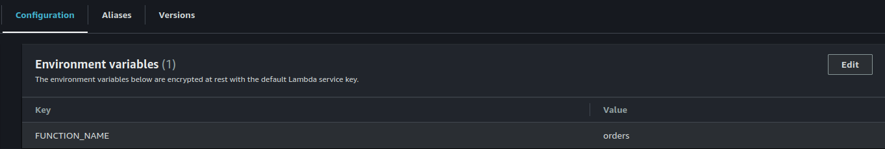

# springboot-aws-lambda
AWS Lambda is a serverless computing service provided by Amazon to reduce the configuration of servers, OS .

AWS Lambda lets you run code without provisioning or managing servers—it scales automatically and only charges for the time your code is running

## Spring Cloud Function : 
[Spring Cloud Function](https://docs.spring.io/spring-cloud-function/docs/3.0.14.RELEASE/reference/html/aws.html#_aws_lambda)


## Dependency (Required)

```javascript
		<dependencyManagement>
        <dependencies>
            <dependency>
                <groupId>org.springframework.cloud</groupId>
                <artifactId>spring-cloud-dependencies</artifactId>
                <version>${spring-cloud.version}</version>
                <type>pom</type>
                <scope>import</scope>
            </dependency>
            <dependency>
                <groupId>software.amazon.awssdk</groupId>
                <artifactId>bom</artifactId>
                <version>${aws.java.sdk.version}</version>
                <type>pom</type>
                <scope>import</scope>
            </dependency>
        </dependencies>
    </dependencyManagement>
```

## Plugins (It will helps to downstream your jar size)

```javascript
		<plugins>
			 <plugin>
                <groupId>org.springframework.boot</groupId>
                <artifactId>spring-boot-maven-plugin</artifactId>
                <dependencies>
                    <dependency>
                        <groupId>org.springframework.boot.experimental</groupId>
                        <artifactId>spring-boot-thin-layout</artifactId>
                        <version>${wrapper.version}</version>
                    </dependency>
                </dependencies>
            </plugin>
            <plugin>
                <groupId>org.apache.maven.plugins</groupId>
                <artifactId>maven-shade-plugin</artifactId>
                <version>3.2.4</version>
                <configuration>
                    <createDependencyReducedPom>false</createDependencyReducedPom>
                    <shadedArtifactAttached>true</shadedArtifactAttached>
                    <shadedClassifierName>aws</shadedClassifierName>
                </configuration>
            </plugin>
        </plugins>
        <finalName>springboot-aws-lambda</finalName>
```


## Execution Lambda

mvn clean install


## Create Lambda Function Java 17


## Upload Jar generate command line mvn clean Install


## Runtime settings


## Environment variables


## Test


## Result


